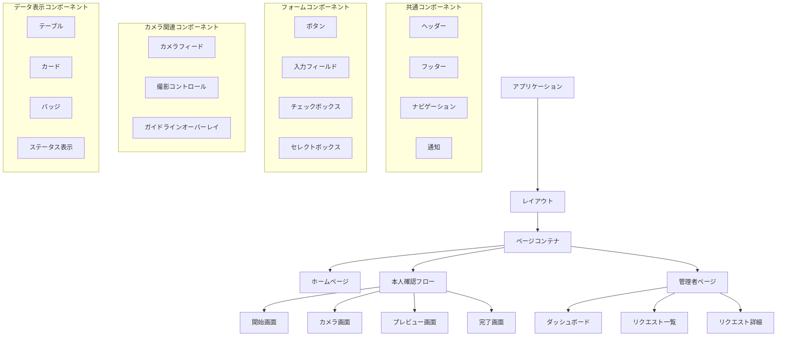

# UIコンポーネント設計

## コンポーネント階層

本システムのUIコンポーネントは以下の階層で構成されます。

## 共通コンポーネント

### レイアウト
- **説明**: アプリケーション全体のレイアウトを定義
- **責務**: 
  - ヘッダー、フッター、メインコンテンツの配置
  - レスポンシブデザインの基本構造提供
- **状態**: なし
- **子コンポーネント**: ヘッダー、フッター、メインコンテンツ

### ヘッダー
- **説明**: 全画面上部に表示されるヘッダー
- **責務**: 
  - アプリケーションロゴ表示
  - ナビゲーションメニュー表示
  - ユーザーアカウント情報表示
- **状態**: ユーザーログイン状態
- **子コンポーネント**: ロゴ、ナビゲーションメニュー、ユーザーメニュー

### フッター
- **説明**: 全画面下部に表示されるフッター
- **責務**: 
  - 著作権情報表示
  - 利用規約・プライバシーポリシーへのリンク
- **状態**: なし
- **子コンポーネント**: なし

### 通知
- **説明**: システムからのメッセージを表示
- **責務**: 
  - 成功、警告、エラー、情報メッセージの表示
  - 一定時間後の自動非表示
- **状態**: 表示状態、メッセージ種類、メッセージ内容
- **子コンポーネント**: なし

## フォームコンポーネント

### ボタン
- **説明**: ユーザーアクションのトリガー
- **責務**: 
  - クリックイベントの処理
  - 視覚的フィードバック提供
- **バリエーション**: 
  - プライマリー（主要アクション）
  - セカンダリー（補助アクション）
  - デンジャー（危険な操作）
  - ゴースト（目立たないアクション）
- **状態**: 通常、ホバー、アクティブ、無効
- **子コンポーネント**: なし

### 入力フィールド
- **説明**: テキスト入力を受け付けるフィールド
- **責務**: 
  - ユーザー入力の受付
  - バリデーション
  - エラー表示
- **バリエーション**: 
  - テキスト
  - パスワード
  - メール
  - 数値
  - テキストエリア
- **状態**: 通常、フォーカス、エラー、無効
- **子コンポーネント**: なし

### チェックボックス
- **説明**: 真偽値の選択を受け付けるコンポーネント
- **責務**: 
  - 選択状態の管理
  - 視覚的フィードバック提供
- **状態**: 選択済み、未選択、無効
- **子コンポーネント**: なし

## カメラ関連コンポーネント

### カメラフィード
- **説明**: カメラからのリアルタイム映像を表示
- **責務**: 
  - カメラデバイスへのアクセス
  - 映像ストリームの表示
  - エラーハンドリング
- **状態**: 
  - 初期化中
  - ストリーミング中
  - エラー
- **子コンポーネント**: ガイドラインオーバーレイ

### 撮影コントロール
- **説明**: カメラ操作のためのコントロール
- **責務**: 
  - 撮影ボタン提供
  - カメラ切り替え機能（利用可能な場合）
  - キャンセル機能
- **状態**: 撮影可能、撮影不可
- **子コンポーネント**: ボタン

### ガイドラインオーバーレイ
- **説明**: カメラフィード上に表示される撮影ガイドライン
- **責務**: 
  - 適切な撮影位置の視覚的ガイド提供
  - 撮影のヒント表示
- **状態**: 表示/非表示
- **子コンポーネント**: なし

## データ表示コンポーネント

### テーブル
- **説明**: 構造化データを表形式で表示
- **責務**: 
  - データの行と列での表示
  - ソート機能
  - ページネーション
- **状態**: ローディング、データ表示中、エラー
- **子コンポーネント**: テーブルヘッダー、テーブル行、ページネーションコントロール

### カード
- **説明**: 関連情報をグループ化して表示
- **責務**: 
  - 情報の視覚的グループ化
  - アクション提供
- **バリエーション**: 
  - 基本カード
  - アクションカード
  - 画像カード
- **状態**: 通常、ホバー、アクティブ
- **子コンポーネント**: カードヘッダー、カードコンテンツ、カードフッター

### バッジ
- **説明**: ステータスや数値を小さく表示
- **責務**: 
  - 簡潔な情報表示
  - 視覚的区別の提供
- **バリエーション**: 
  - 成功（緑）
  - 警告（黄）
  - エラー（赤）
  - 情報（青）
  - カウント（灰）
- **状態**: なし
- **子コンポーネント**: なし

### ステータス表示
- **説明**: リクエストのステータスを視覚的に表示
- **責務**: 
  - ステータス状態の視覚的表現
  - 色による区別
- **バリエーション**: 
  - 未処理（灰色）
  - 審査中（青色）
  - 承認済み（緑色）
  - 却下（赤色）
  - 追加情報要求（黄色）
- **状態**: なし
- **子コンポーネント**: なし

## ページコンポーネント

### ホームページ
- **説明**: アプリケーションのメインページ
- **責務**: 
  - 本人確認プロセスの概要説明
  - プロセス開始ボタンの提供
- **状態**: なし
- **子コンポーネント**: ヘッダー、フッター、コンテンツセクション、ボタン

### 本人確認開始画面
- **説明**: 本人確認プロセスの説明と同意を得る画面
- **責務**: 
  - 詳細な手順説明
  - プライバシーポリシー同意の取得
  - カメラ起動への導線提供
- **状態**: 同意状態
- **子コンポーネント**: ヘッダー、フッター、コンテンツセクション、チェックボックス、ボタン

### カメラ画面
- **説明**: 本人確認画像を撮影する画面
- **責務**: 
  - カメラフィード表示
  - 撮影機能提供
  - ガイドライン表示
- **状態**: カメラ状態
- **子コンポーネント**: カメラフィード、撮影コントロール、ガイドラインオーバーレイ

### プレビュー画面
- **説明**: 撮影した画像を確認する画面
- **責務**: 
  - 撮影画像表示
  - 画像確認機能提供
  - 撮り直し・使用の選択肢提供
- **状態**: なし
- **子コンポーネント**: 画像表示、ボタングループ

### 完了画面
- **説明**: 本人確認リクエスト送信完了を通知する画面
- **責務**: 
  - 完了メッセージ表示
  - 次のステップ説明
  - ホームへの導線提供
- **状態**: なし
- **子コンポーネント**: メッセージ表示、ボタン

### 管理者ダッシュボード
- **説明**: 管理者向け統計情報表示画面
- **責務**: 
  - システム統計表示
  - クイックアクセスリンク提供
- **状態**: なし
- **子コンポーネント**: 統計カード、グラフ、リンクリスト

### リクエスト一覧
- **説明**: 本人確認リクエスト一覧表示画面
- **責務**: 
  - リクエスト一覧表示
  - フィルタリング・ソート機能提供
  - 詳細画面への導線提供
- **状態**: フィルター状態、ソート状態、ローディング状態
- **子コンポーネント**: フィルターコントロール、テーブル、ページネーション
- **実装状況**: 完了
  - ステータスによるフィルタリング機能実装済み
  - リクエスト一覧の非同期読み込み実装済み
  - エラーハンドリング実装済み

### リクエスト詳細
- **説明**: 個別リクエストの詳細表示・処理画面
- **責務**: 
  - リクエスト詳細情報表示
  - 画像表示
  - 承認・却下機能提供
- **状態**: 処理状態、ローディング状態、エラー状態
- **子コンポーネント**: 画像表示、情報カード、コメント入力、ボタングループ
- **実装状況**: 完了
  - 承認・拒否処理の非同期実行実装済み
  - コメント入力機能実装済み
  - 処理中のローディング表示実装済み
  - エラーハンドリング実装済み

## 管理画面専用コンポーネント

### RequestTable
- **説明**: 本人確認リクエスト一覧を表示するテーブル
- **責務**:
  - リクエストデータの表形式での表示
  - ステータスに応じた視覚的表現
  - 操作ボタンの提供
- **状態**: データ読み込み中、データ表示中、エラー
- **子コンポーネント**: テーブルヘッダー、テーブル行、ステータスバッジ、アクションボタン
- **実装状況**: 完了
  - ステータスに応じた色分け表示実装済み
  - 日時のフォーマット表示実装済み
  - 詳細表示機能実装済み

### RequestStatusBadge
- **説明**: リクエストのステータスを視覚的に表示するバッジ
- **責務**:
  - ステータス状態の視覚的表現
  - 色による区別
- **バリエーション**:
  - PENDING（黄色）: 審査待ち
  - APPROVED（緑色）: 承認済み
  - REJECTED（赤色）: 拒否
- **状態**: なし
- **子コンポーネント**: なし
- **実装状況**: 完了
  - すべてのステータスバリエーション実装済み
  - アクセシビリティ対応済み

### RequestActionButton
- **説明**: リクエストに対するアクション（承認・拒否）を実行するボタン
- **責務**:
  - アクション実行のトリガー
  - 処理中の視覚的フィードバック
  - 確認ダイアログの表示
- **バリエーション**:
  - 承認ボタン（緑色）
  - 拒否ボタン（赤色）
- **状態**: 通常、処理中、無効
- **子コンポーネント**: なし
- **実装状況**: 完了
  - 処理中のローディング表示実装済み
  - 確認ダイアログ連携実装済み
  - エラーハンドリング実装済み

### CommentInput
- **説明**: リクエスト処理時のコメント入力フィールド
- **責務**:
  - コメントテキスト入力
  - バリデーション（拒否時は必須）
  - エラー表示
- **状態**: 通常、フォーカス、エラー
- **子コンポーネント**: なし
- **実装状況**: 完了
  - 拒否時の必須バリデーション実装済み
  - エラーメッセージ表示実装済み

### ImagePreviewCard
- **説明**: 本人確認画像を表示するカード
- **責務**:
  - 画像の表示
  - 拡大表示機能
  - 画像メタデータ表示
- **状態**: 読み込み中、表示中、エラー
- **子コンポーネント**: 画像、メタデータ表示
- **実装状況**: 完了
  - 画像の非同期読み込み実装済み
  - エラーハンドリング実装済み
  - アクセシビリティ対応済み

## テスト状況

すべてのコンポーネントに対して以下のテストが実装・実行されています：

1. **レンダリングテスト**: コンポーネントが正しくレンダリングされることを確認
2. **インタラクションテスト**: ユーザー操作に対して正しく反応することを確認
3. **状態変化テスト**: 状態変化に応じて正しく表示が更新されることを確認
4. **エラーハンドリングテスト**: エラー状態での表示と挙動を確認
5. **アクセシビリティテスト**: WAI-ARIAガイドラインへの準拠を確認

## 今後の改善計画

1. **パフォーマンス最適化**:
   - 大量データ表示時のメモ化（React.memo, useMemo）の適用
   - 画像の遅延読み込み実装

2. **UI/UX改善**:
   - モバイル表示の最適化
   - ダークモード対応
   - アニメーション追加によるユーザー体験向上

3. **アクセシビリティ強化**:
   - キーボードナビゲーションの改善
   - スクリーンリーダー対応の強化
   - コントラスト比の最適化 