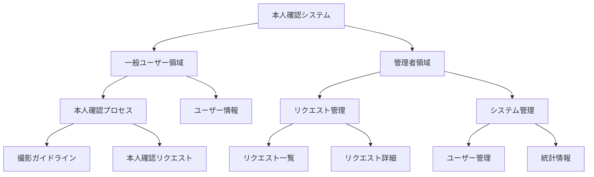

# 情報アーキテクチャ

## 情報構造

本システムの情報は以下のように構造化されます。

## コンテンツ要素

### 一般ユーザー領域

#### 本人確認プロセス
- **撮影ガイドライン**
  - 本人確認書類の種類と撮影方法
  - 撮影時の注意点（明るさ、角度など）
  - 良い例・悪い例の画像サンプル
- **本人確認リクエスト**
  - リクエスト履歴
  - リクエストステータス
  - 通知メッセージ

#### ユーザー情報
- プロフィール情報
- アカウント設定

### 管理者領域

#### リクエスト管理
- **リクエスト一覧**
  - フィルタリングオプション（日付、ステータス、ユーザー）
  - ソートオプション（日付、優先度）
  - 一括操作機能
- **リクエスト詳細**
  - 提出画像
  - ユーザー情報
  - 審査履歴
  - コメント/メモ

#### システム管理
- **ユーザー管理**
  - ユーザー一覧
  - 権限設定
- **統計情報**
  - 処理済みリクエスト数
  - 平均処理時間
  - ステータス別リクエスト数

## 画面ごとの情報要素

### ホーム画面
- システム名とロゴ
- 本人確認プロセスの概要説明
- 「本人確認を開始」ボタン
- ユーザーアカウント情報（ログイン状態）

### 本人確認開始画面
- 詳細な手順説明
- 必要書類の説明と画像例
- プライバシーポリシー概要と同意チェックボックス
- 「カメラを起動」ボタン
- 「キャンセル」ボタン

### カメラ撮影画面
- カメラフィードのリアルタイム表示
- 撮影ガイドライン（オーバーレイ表示）
- 撮影ボタン
- キャンセルボタン
- カメラ切り替えボタン（利用可能な場合）

### プレビュー・確認画面
- 撮影画像の大きな表示
- 確認メッセージ
- 「この画像を使用する」ボタン
- 「撮り直す」ボタン
- 「キャンセル」ボタン

### 完了画面
- 完了メッセージ
- 次のステップの説明
- リクエスト参照番号
- 「ホームに戻る」ボタン

### 管理者ダッシュボード
- 統計情報の視覚的表示（グラフ/チャート）
- 未処理リクエスト数
- 最近の活動履歴
- クイックアクセスリンク

### 本人確認要求一覧画面
- フィルターとソートコントロール
- リクエスト一覧テーブル
  - リクエストID
  - 提出日時
  - ユーザー名
  - ステータス
  - アクション
- ページネーションコントロール
- 検索機能

### 確認詳細画面
- 提出画像（拡大表示可能）
- ユーザー情報パネル
- メタデータ表示（提出日時、デバイス情報など）
- ステータス変更コントロール
- コメント入力欄
- 「承認」「却下」ボタン
- 「一覧に戻る」ボタン

## ラベリングシステム

### ステータス表示
- **未処理**: 灰色
- **審査中**: 青色
- **承認済み**: 緑色
- **却下**: 赤色
- **追加情報要求**: 黄色

### ボタンラベル
- 主要アクション: 目立つ色（青/緑）で表示
- キャンセル/戻る: 目立たない色（灰色）で表示
- 危険な操作（削除など）: 警告色（赤）で表示

### 通知メッセージ
- **成功**: 緑色の背景
- **警告**: 黄色の背景
- **エラー**: 赤色の背景
- **情報**: 青色の背景 