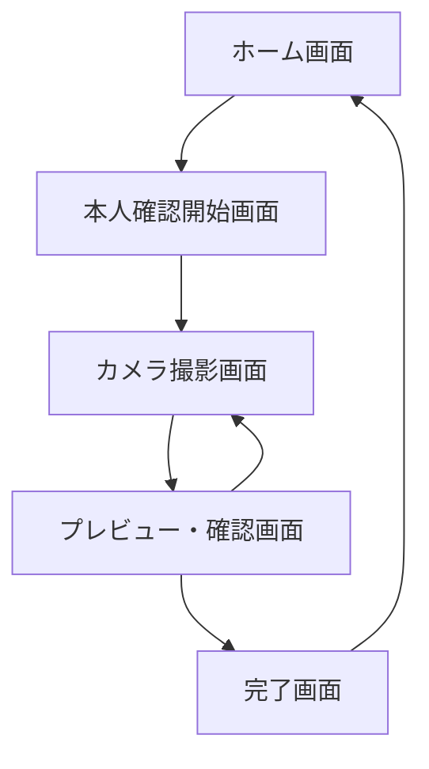
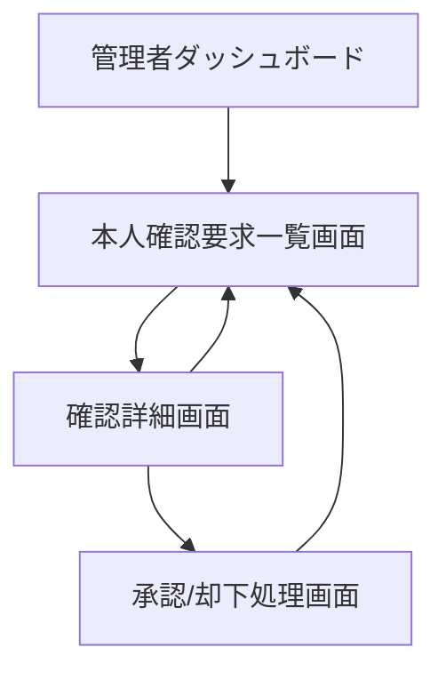

# 画面遷移図

## 本人確認フロー

## 画面詳細

### ホーム画面
- 本人確認プロセスを開始するためのエントリーポイント
- 本人確認の目的と手順の簡単な説明
- 「本人確認を開始」ボタン

### 本人確認開始画面
- 本人確認の詳細な手順説明
- 必要な書類の種類と撮影方法の説明
- プライバシーポリシーへの同意確認
- 「カメラを起動」ボタン

### カメラ撮影画面
- カメラフィードのリアルタイム表示
- 撮影ガイドライン（顔と書類が同時に映るように）
- 撮影ボタン
- キャンセルボタン

### プレビュー・確認画面
- 撮影した画像のプレビュー
- 画像の確認メッセージ
- 「この画像を使用する」ボタン
- 「撮り直す」ボタン

### 完了画面
- 本人確認リクエスト送信完了メッセージ
- 次のステップの説明
- 「ホームに戻る」ボタン

## 管理者用画面

### 管理者ダッシュボード
- 統計情報の表示
- 未処理の本人確認リクエスト数
- 「本人確認リクエスト一覧」へのリンク

### 本人確認要求一覧画面
- リクエスト一覧（ステータス、日時、ユーザー情報）
- フィルタリング機能
- ソート機能
- 各リクエストの詳細画面へのリンク

### 確認詳細画面
- 撮影された画像の表示
- ユーザー情報の表示
- 「承認」「却下」ボタン
- コメント入力欄

### 承認/却下処理画面
- 処理結果の確認
- 必要に応じて追加情報の入力
- 「一覧に戻る」ボタン 