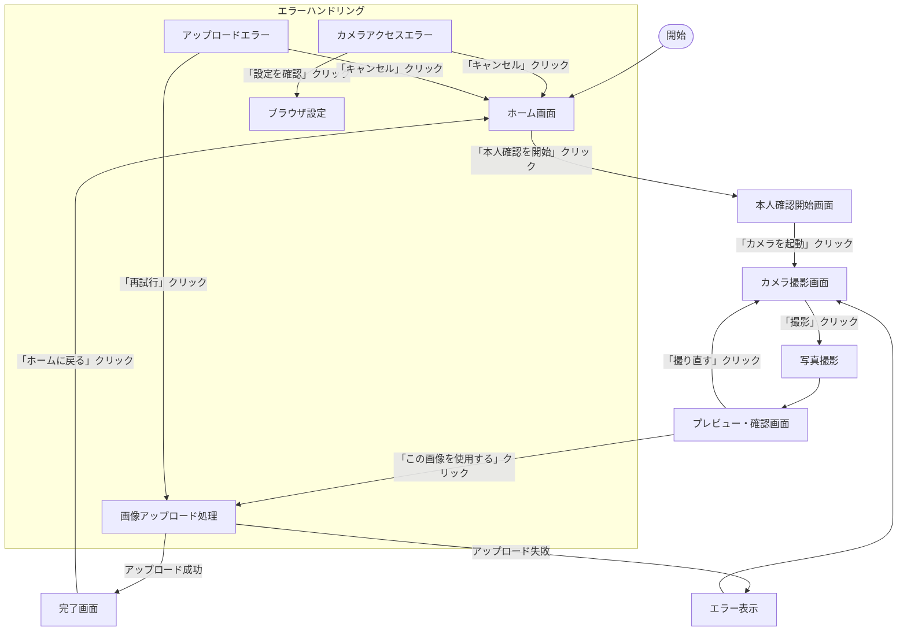
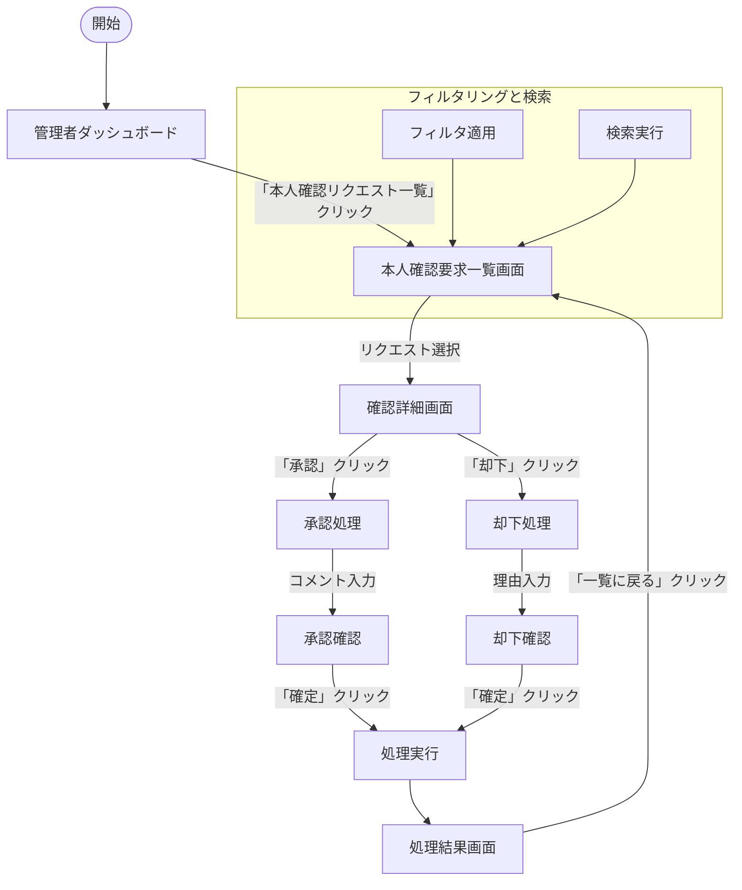

# ユーザーフロー図

## 一般ユーザーの本人確認フロー

## 管理者の本人確認審査フロー

## 情報の流れ

### 一般ユーザーフロー
1. **ホーム画面**
   - 入力: なし
   - 出力: ユーザーの操作選択

2. **本人確認開始画面**
   - 入力: なし
   - 出力: ユーザーの同意情報

3. **カメラ撮影画面**
   - 入力: カメラデバイスからの映像ストリーム
   - 出力: 撮影された画像データ

4. **プレビュー・確認画面**
   - 入力: 撮影された画像データ
   - 出力: ユーザーの確認結果（承認/撮り直し）

5. **完了画面**
   - 入力: アップロード結果
   - 出力: なし

### 管理者フロー
1. **管理者ダッシュボード**
   - 入力: システム統計データ
   - 出力: ユーザーの操作選択

2. **本人確認要求一覧画面**
   - 入力: 本人確認リクエストデータ
   - 出力: 選択されたリクエスト

3. **確認詳細画面**
   - 入力: 選択されたリクエストの詳細データ
   - 出力: 審査結果（承認/却下）とコメント

4. **処理結果画面**
   - 入力: 処理結果
   - 出力: なし

## 必要なデータ要素

### 一般ユーザーフロー
- ユーザーID
- セッション情報
- カメラデバイス情報
- 撮影画像データ
- アップロード状態
- エラー情報（発生時）

### 管理者フロー
- 管理者ID
- 本人確認リクエスト一覧
  - リクエストID
  - ユーザー情報
  - 提出日時
  - 現在のステータス
- リクエスト詳細情報
  - 画像データ
  - メタデータ（撮影日時、デバイス情報など）
- 審査結果
  - 承認/却下ステータス
  - コメント
  - 処理日時 